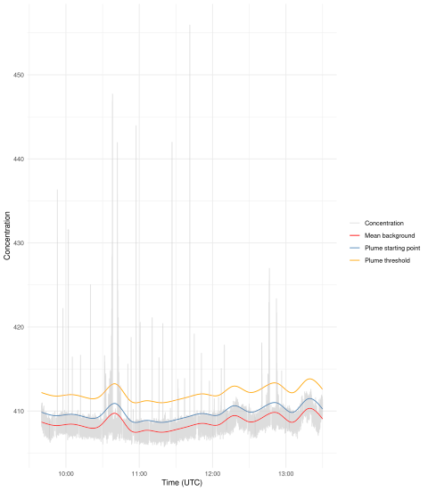
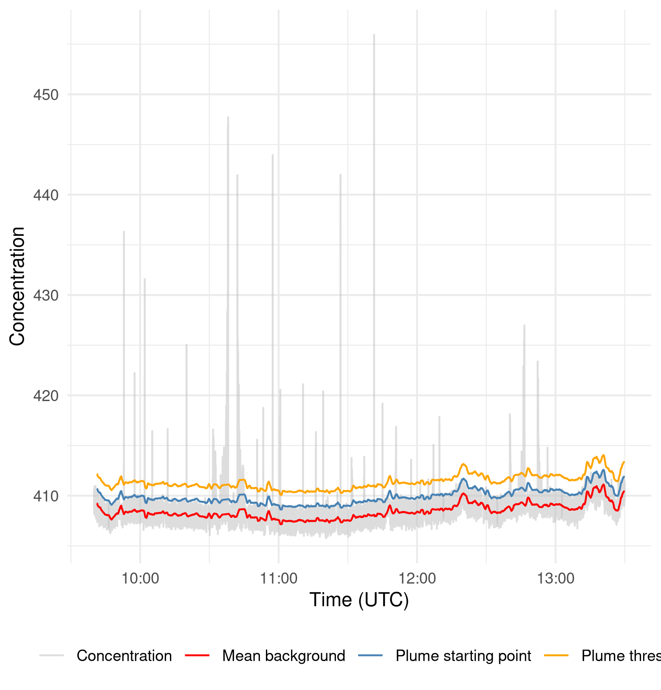
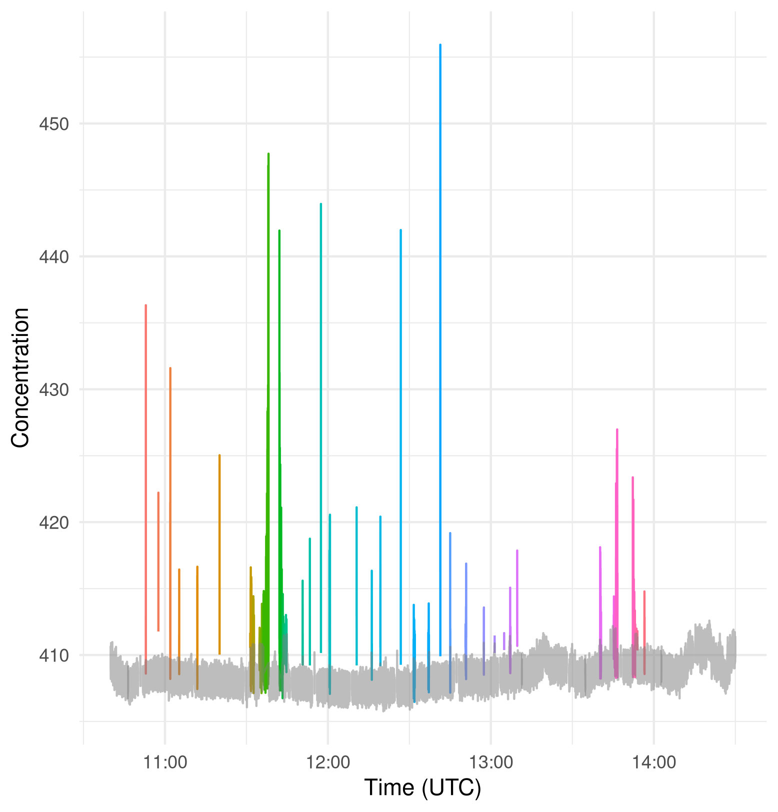
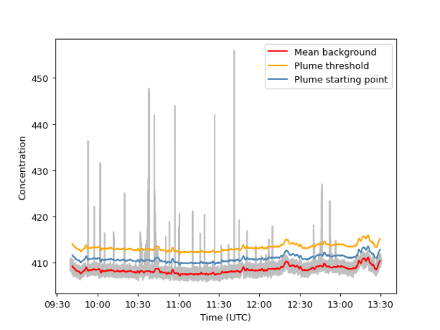
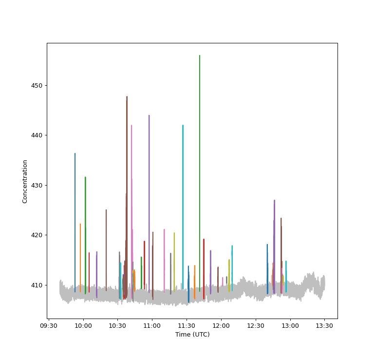

# ACRUISE Peak ID

R and Python functions for identifying peaks from measurements taken from ACRUISE campaigns.

## Methodology

The workflow of the peak extraction comprises 3 steps:

  1. Identify the background from the concentration time-series
  2. Identify the peaks by substracting the background
  3. Integrate the area under the peaks to determine the corresponding concentration

Typically steps 1 and 2 are iterated until the detected peaks give an acceptable subjective visual classification.
  
The following sections provide a few additional details.

### Background identification

The observed time-series $y(t)$ is assumed to comprise a background concentration $b(t)$ with irregular, sparse plumes $p(t)$ with background noise having constant variance $\epsilon \sim N(0, \sigma)$:

$$y(t) = b(t) + p(t) + \epsilon(t)$$

The background is estimated using either a Generalized Additive Model (R only for now), or a rolling window approach (both R and Python), giving $\hat{b}(t)$.

### Plume identification

Subtracting $\hat{b}(t)$ from $y(t)$ results in the signal comprising the normally distributed noise and the irregular plumes, from which the noise variance is estimated as the standard deviation ($\hat{\sigma}$)

Plumes are then identified as any timepoints where $y(t) \geq \hat{b}(t) + k \hat{\sigma}$, where $k$ is a user-chosen parameter (`plume_sd_threshold`).
This threshold will usually be at least 3, so if plumes were exclusively defined by this criteria then they would exclude some points between $p(t)$ and $k$ standard deviations.
Instead, for each plume identified by the above criteria, it is then expanded to include points up to $j$ standard deviations away from $p(t)$, where $k > j$. 
The default value for $j$ is 1 and is specified in the code as `plume_sd_starting`.

Plumes that are close together can be combined by using the `plume_buffer` parameter, which combines plumes if they are within `plume_buffer` timepoints.

### Integrating peaks

Currently the only method for integrating the area under the peaks is to use the trapezoidal approximation.

## R package

### Installation

To install the R package, run `remotes::install_github("https://github.com/wacl-york/acruise-peakid", subdir="acruiseR")`

### Usage

Below shows an example of loading some CO2 data for use with `acruiseR` and subsetting it to a period of interest.
The `UTC_time` column contains the timestamps which are recorded with a sample period of 100ms.
The default R data structure for timestamps (`POSIXct`, which is also used under the hood by the `lubridate` package) cannot accurately store times at millisecond resolution, so instead it is parsed with the `nanotime` package which is accurate to nanoseconds (the same as `pandas`).

```r
library(tidyverse)
library(nanotime)
library(acruiseR)

df_co2 <- read_csv(
    "../data/C258_FGGA_FAAM.txt"
)
df_co2$time_nano <- as.nanotime(df_co2$UTC_time, format="%d/%m/%Y %H:%M:%E3S", tz="UTC")
# Restrict to time period of interest if necessary
study_window <- as.nanoival("+2021-10-04T09:40:00UTC -> 2021-10-04T13:30:00UTC+")
df_co2 <- df_co2[df_co2$time_nano %in% study_window,]
```

The first step is to identify the background level, against which plumes will be compared.
The `identify_background` function takes in the concentration, the background identification method, and several tuning parameters - it is highly likely that the parameter values shown below will need to be tuned for your dataset.
Run `?identify_background` to see a description of these parameters.

The first method `gam` uses a Generalised Additive Model, which is a non-linear smooth of the data (thus it should account for time-varying backgrounds).
It only has 1 parameter to tune: `k`.

```r
bg_gam <- identify_background(df_co2$CO2_ppm, method="gam", k=20)
```

The other method is the original rolling average method, which has 3 tuning parameters.

```r
bg_rolling <- identify_background(df_co2$CO2_ppm, method="rolling", bg_sd_window=180, bg_sd_threshold=0.5, bg_mean_window=660)
```

To determine the appropriateness of the extracted background, `plot_background` plots the concentration time-series with the background highlighted alongside the limit of what is considered a plume, defined as `plume_sd_threshold` standard deviations about the mean background.
Any plumes will then be determined to start from the point at which they cross `plume_sd_starting` standard deviations above the mean background.
If they were considered to start from the point at which they cross the `plume_sd_threshold` boundary instead then some plume data would be lost.

```r
plot_background(df_co2$CO2_ppm, df_co2$time_nano, bg_gam, plume_sd_threshold=3, plume_sd_starting=1)
```



This function returns a `ggplot2` object, so any additional tweaks can be made.

```r
p <- plot_background(df_co2$CO2_ppm, df_co2$time_nano, bg_gam, plume_sd_threshold=3, plume_sd_starting=1)
p + theme(legend.position="bottom")
```



Once both a satisfactory background and suitable values for `plume_sd_threshold` and `plume_sd_starting` have been identified, the plumes can be detected using `detect_plumes` (again use `?peakid.detect_plumes` to see full details for what arguments it takes).

The plumes can be visually inspected using the `plot_plumes` function, adjusting the parameters in the previous step until necessary.
Again, the returned plot can be modified through usual `ggplot2` functions.

```r
plumes <- detect_plumes(df_co2$CO2_ppm, bg_gam, df_co2$time_nano, plume_sd_threshold=3, plume_sd_starting=1, plume_buffer=5)
plot_plumes(df_co2$CO2_ppm, df_co2$time_nano, plumes)
```



Once the plumes have been finalised, the area under the plumes can be calculated using a trapezoidal approach.
It's crucial to subtract the background from the concentration time-series for this function (note that the background is held in the `bg` attribute of the result from `identify_background`).

```r
co2_areas <- integrate_aup_trapz(df_co2$CO2_ppm - bg_gam$bg, df_co2$time_nano, plumes, dx=0.1)
co2_areas
```

```
                           start                           end       area
1  2021-10-04T09:52:56.600+00:00 2021-10-04T09:52:58.200+00:00  11.614074
2  2021-10-04T09:57:34.900+00:00 2021-10-04T09:57:35.300+00:00   2.822923
3  2021-10-04T10:01:56.200+00:00 2021-10-04T10:01:59.500+00:00  17.836451
4  2021-10-04T10:05:14.900+00:00 2021-10-04T10:05:15.200+00:00   1.526062
5  2021-10-04T10:11:53.900+00:00 2021-10-04T10:11:57.200+00:00   7.316165
6  2021-10-04T10:20:06.100+00:00 2021-10-04T10:20:06.700+00:00   6.189715
7  2021-10-04T10:31:31.800+00:00 2021-10-04T10:31:39.500+00:00  15.163421
8  2021-10-04T10:31:46.800+00:00 2021-10-04T10:31:50.800+00:00  16.566573
9  2021-10-04T10:32:26.600+00:00 2021-10-04T10:32:47.200+00:00  46.219828
10 2021-10-04T10:35:40.900+00:00 2021-10-04T10:35:42.100+00:00   3.651631
...
```

## Python package

### Installation

To install the Python package, run `pip install git+https://github.com/wacl-york/acruise-peakid#subdirectory=acruisepy`.

### Usage

Below shows an example of loading some CO2 data into Pandas for use with `acruisepy` and subsetting it to a period of interest.
The first column in the CSV is a datetime, which has been set to to the DataFrame's index.

```python
import datetime
import pandas as pd
from acruisepy import peakid

df_co2 = pd.read_csv(
    "C258_FGGA_FAAM.txt",
    names=["conc", "a", "b"],
    parse_dates=True,
    header=1,
    date_parser=lambda x: datetime.datetime.strptime(x, "%d/%m/%Y %H:%M:%S.%f"),
)
start_time = datetime.datetime(2021, 10, 4, 9, 40, 0)
end_time = datetime.datetime(2021, 10, 4, 13, 30, 0)
df_co2 = df_co2.loc[start_time : end_time]
```

The first step is to identify the background level, against which plumes will be compared.
The `peakid.identify_background` function takes in the concentration and several tuning parameters, here the default values are used but it is highly likely you will need to tune them for your dataset. 
Run `help(peakid.identify_background)` to see a description of these parameters.

```python
bg = peakid.identify_background(df_co2['conc'], bg_sd_window=180, bg_sd_threshold=0.5, bg_mean_window=660)
```

To determine the appropriateness of the extracted background, `plot_background` plots the concentration time-series with the background highlighted alongside the limit of what is considered a plume, defined as `plume_sd_threshold` standard deviations about the mean background.
Any plumes will then be determined to start from the point at which they cross `plume_sd_starting` standard deviations above the mean background.
If they were considered to start from the point at which they cross the `plume_sd_threshold` boundary instead then some plume data would be lost.

```python
peakid.plot_background(df_co2['conc'], bg, plume_sd_threshold=4, plume_sd_starting=2)
```



Once both a satisfactory background and suitable values for `plume_sd_threshold` and `plume_sd_starting` have been identified, the plumes can be detected using `peakid.detect_plumes` (again use `help(peakid.detect_plumes)` to see full details for what arguments it takes).
It's crucial here that both the concentration and the background have a DatetimeIndex, which should be the case if they are loaded in from CSV as shown in the example above.

The plumes can be visually inspected using the `peakid.plot_plumes` function, adjusting the parameters in the previous step until necessary.

```python
plumes = peakid.detect_plumes(df_co2['conc'], bg, plume_sd_threshold=4, plume_sd_starting=2, plume_buffer=5)
peakid.plot_plumes(df_co2['conc'], plumes)
```



Once the plumes have been finalised, the area under the plumes can be calculated.
This is currently done using a trapezoidal approach, see the documentation for `numpy.trapz` for further details.
It's important to subtract the background from the concentration time-series for this function.

```python
co2_areas = peakid.integrate_aup_trapz(df_co2['conc'] - bg, plumes, dx=0.1)
co2_areas
```

```
                    start                     end        area
0 2021-10-04 09:52:56.700 2021-10-04 09:52:58.200   11.551411
0 2021-10-04 09:57:34.900 2021-10-04 09:57:35.200    2.463899
0 2021-10-04 10:01:56.200 2021-10-04 10:01:59.500   18.605635
0 2021-10-04 10:05:13.700 2021-10-04 10:05:15.200    4.229698
0 2021-10-04 10:11:53.900 2021-10-04 10:11:57.200    7.469866
0 2021-10-04 10:20:06.100 2021-10-04 10:20:06.700    6.102518
0 2021-10-04 10:31:23.300 2021-10-04 10:31:23.500    0.650395
0 2021-10-04 10:31:31.800 2021-10-04 10:31:50.900   47.789589
...
```

