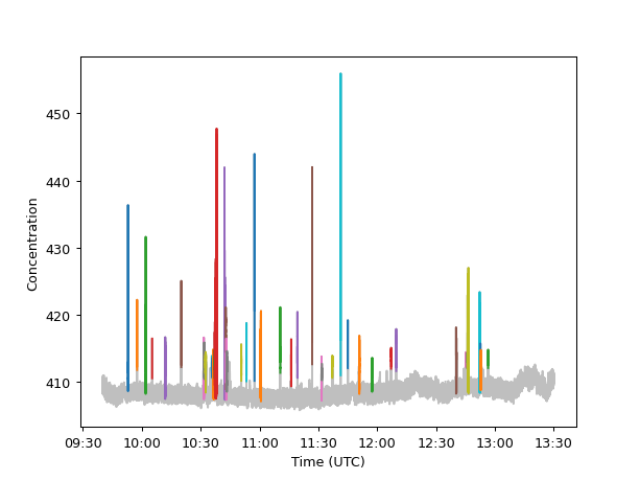

# ACRUISE Peak ID

Python and R functions for identifying peaks from measurements taken from ACRUISE campaigns.

## Python package

### Installation

To install the Python package, run `pip install git+https://github.com/wacl-york/acruise-peakid#subdirectory=acruisepy`.

### Usage

Below shows an example of loading some CO2 data into Pandas for use with `acruisepy` and subsetting it to a period of interest.
The first column in the CSV is a datetime, which has been set to to the DataFrame's index.

```python
import datetime
import pandas as pd
from acruisepy import peakid

df_co2 = pd.read_csv(
    "C258_FGGA_FAAM.txt",
    names=["conc", "a", "b"],
    parse_dates=True,
    header=1,
    date_parser=lambda x: datetime.datetime.strptime(x, "%d/%m/%Y %H:%M:%S.%f"),
)
start_time = datetime.datetime(2021, 10, 4, 9, 40, 0)
end_time = datetime.datetime(2021, 10, 4, 13, 30, 0)
df_co2 = df_co2.loc[start_time : end_time]
```

The first step is to identify the background level, against which plumes will be compared.
The `peakid.identify_background` function takes in the concentration and several tuning parameters, here the default values are used but it is highly likely you will need to tune them for your dataset. 
Run `help(peakid.identify_background)` to see a description of these parameters.

```python
bg = peakid.identify_background(df_co2['conc'], bg_sd_window=180, bg_sd_threshold=0.5, bg_mean_window=660)
```

To determine the appropriateness of the extracted background, `plot_background` plots the concentration time-series with the background highlighted alongside the limit of what is considered a plume, defined as `plume_sd_threshold` standard deviations about the mean background.

```python
peakid.plot_background(df_co2['conc'], bg, plume_sd_threshold=3)
```


Once both a satisfactory background and a suitable value for `plume_sd_threshold` have been identified, the plumes can be detected using `peakid.detect_plumes` (again use `help(peakid.detect_plumes)` to see full details for what arguments it takes).
It's crucial here that both the concentration and the background have a DatetimeIndex, which should be the case if they are loaded in from CSV as shown in the example above.

The plumes can be visually inspected using the `peakid.plot_plumes` function, adjusting the parameters in the previous step until necessary.

```python
plumes = peakid.detect_plumes(df_co2['conc'], bg, plume_sd_threshold=3, plume_buffer=10)
peakid.plot_plumes(df_co2['conc'], plumes)
```



Once the plumes have been finalised, the area under the plumes can be calculated.
This is currently done using a trapezoidal approach, see the documentation for `numpy.trapz` for further details.
It's important to subtract the background from the concentration time-series for this function.

```python
co2_areas = peakid.integrate_aup_trapz(df_co2['conc'] - bg, plumes, dx=0.1)
co2_areas
```

## R package

Coming soon...
