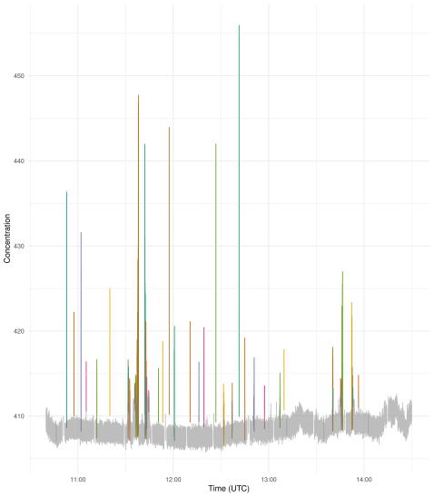

# acruiseR

### Installation

To install the R package, run `remotes::install_github("https://github.com/wacl-york/acruise-peakid", subdir="acruiseR")`

### Usage

Below shows an example of loading some CO2 data for use with `acruiseR` and subsetting it to a period of interest.
The `UTC_time` column contains the timestamps which are recorded with a sample period of 100ms.
The default R data structure for timestamps (`POSIXct`, which is also used under the hood by the `lubridate` package) cannot accurately store times at millisecond resolution, so instead it is parsed with the `nanotime` package which is accurate to nanoseconds (the same as `pandas`).

```r
library(tidyverse)
library(nanotime)
library(acruiseR)

df_co2 <- read_csv(
    "../data/C258_FGGA_FAAM.txt"
)
df_co2$time_nano <- as.nanotime(df_co2$UTC_time, format="%d/%m/%Y %H:%M:%E3S", tz="UTC")
# Restrict to time period of interest if necessary
study_window <- as.nanoival("+2021-10-04T09:40:00UTC -> 2021-10-04T13:30:00UTC+")
df_co2 <- df_co2[df_co2$time_nano %in% study_window,]
```

The first step is to identify the background level, against which plumes will be compared.
The `identify_background` function takes in the concentration, the background identification method, and several tuning parameters - it is highly likely that the parameter values shown below will need to be tuned for your dataset.
Run `?identify_background` to see a description of these parameters.

The first method `gam` uses a Generalised Additive Model, which is a non-linear smooth of the data (thus it should account for time-varying backgrounds).
It only has 1 parameter to tune: `k`.

```r
bg_gam <- identify_background(df_co2$CO2_ppm, method="gam", k=20)
```

The other method is the original rolling average method, which has 3 tuning parameters.

```r
bg_rolling <- identify_background(df_co2$CO2_ppm, method="rolling", bg_sd_window=180, bg_sd_threshold=0.5, bg_mean_window=660)
```

To determine the appropriateness of the extracted background, `plot_background` plots the concentration time-series with the background highlighted alongside the limit of what is considered a plume, defined as `plume_sd_threshold` standard deviations about the mean background.
Any plumes will then be determined to start from the point at which they cross `plume_sd_starting` standard deviations above the mean background.
If they were considered to start from the point at which they cross the `plume_sd_threshold` boundary instead then some plume data would be lost.

```r
plot_background(df_co2$CO2_ppm, df_co2$time_nano, bg_gam, plume_sd_threshold=3, plume_sd_starting=1)
```


This function returns a `ggplot2` object, so any additional tweaks can be made.

```r
p <- plot_background(df_co2$CO2_ppm, df_co2$time_nano, bg_gam, plume_sd_threshold=3, plume_sd_starting=1)
p + theme(legend.position="bottom")
```


Once both a satisfactory background and suitable values for `plume_sd_threshold` and `plume_sd_starting` have been identified, the plumes can be detected using `detect_plumes` (again use `?peakid.detect_plumes` to see full details for what arguments it takes).

The plumes can be visually inspected using the `plot_plumes` function, adjusting the parameters in the previous step until necessary.
Again, the returned plot can be modified through usual `ggplot2` functions.

```r
plumes <- detect_plumes(df_co2$CO2_ppm, bg_gam, df_co2$time_nano, plume_sd_threshold=3, plume_sd_starting=1, plume_buffer=5)
plot_plumes(df_co2$CO2_ppm, df_co2$time_nano, plumes)
```



Once the plumes have been finalised, the area under the plumes can be calculated using a trapezoidal approach.
It's crucial to subtract the background from the concentration time-series for this function (note that the background is held in the `bg` attribute of the result from `identify_background`).

```r
co2_areas <- integrate_aup_trapz(df_co2$CO2_ppm - bg_gam$bg, df_co2$time_nano, plumes, dx=0.1)
co2_areas
```

```
                           start                           end       area
1  2021-10-04T09:52:56.600+00:00 2021-10-04T09:52:58.200+00:00  11.614074
2  2021-10-04T09:57:34.900+00:00 2021-10-04T09:57:35.300+00:00   2.822923
3  2021-10-04T10:01:56.200+00:00 2021-10-04T10:01:59.500+00:00  17.836451
4  2021-10-04T10:05:14.900+00:00 2021-10-04T10:05:15.200+00:00   1.526062
5  2021-10-04T10:11:53.900+00:00 2021-10-04T10:11:57.200+00:00   7.316165
6  2021-10-04T10:20:06.100+00:00 2021-10-04T10:20:06.700+00:00   6.189715
7  2021-10-04T10:31:31.800+00:00 2021-10-04T10:31:39.500+00:00  15.163421
8  2021-10-04T10:31:46.800+00:00 2021-10-04T10:31:50.800+00:00  16.566573
9  2021-10-04T10:32:26.600+00:00 2021-10-04T10:32:47.200+00:00  46.219828
10 2021-10-04T10:35:40.900+00:00 2021-10-04T10:35:42.100+00:00   3.651631
...
```
