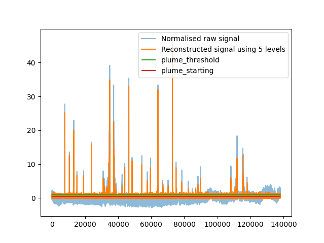

# acruisepy 

## Installation

To install the Python package, run `pip install git+https://github.com/wacl-york/acruise-peakid#subdirectory=acruisepy`.

## Usage

Below shows an example of loading some CO2 data into Pandas for use with `acruisepy` and subsetting it to a period of interest.
The first column in the CSV is a datetime, which has been set to to the DataFrame's index **NB: a datetime index must be used**.

```python
import datetime
import pandas as pd
from acruisepy import peakid

df_co2 = pd.read_csv(
    "../data/C258_FGGA_FAAM.txt",
    names=["conc", "a", "b"],
    parse_dates=True,
    header=1,
    date_format="%d/%m/%Y %H:%M:%S.%f"
)
start_time = datetime.datetime(2021, 10, 4, 9, 40, 0)
end_time = datetime.datetime(2021, 10, 4, 13, 30, 0)
df_co2 = df_co2.loc[start_time : end_time]
```

### Wavelet plume detection

A new feature in the Python version is the ability to directly identify plumes using wavelets, rather than the 2-step process of identifying the background and subtracting it (detailed below and in the R package documentation).
This has the added benefit of being far faster than the GAM method using in the R package but still only having a single dial to tune.

There are 3 main steps to the process:

  - 1. Identify an optimal number of Wavelet levels that allow for the best reconstruction of the plumes, without adding background noise
  - 2. Choose an appropriate threshold for what is considered a plume
  - 3. Tune the buffer to allow nearby plumes to combine

A brief introduction to tuning the number of Wavelet levels is provided here.
Firstly identify how many possible levels can be used in the decomposition.

```python
peakid.max_wavelet_level(df_co2['conc'])
```

```
17
```

The 17 levels correspond to different frequency bands of the original signal, with level 1 being the lowest frequency and 17 the highest.
We want a high-pass filter that only reconstructs the high-frequency plumes and is flat during the background.

At a first attempt, try using just 1 level.
By using argument `plot=True`, the reconstructed time-series will be plotted alongside the (normalised) raw signal and the horizontal lines that will be later used to demarcate plumes.
This first attempt finds several plumes, although certainly not all of them or enough to use by itself, but none of the low-frequency baseline has been picked up.

```python
peakid.detect_plumes_wavelets(df_co2['conc'],
                              levels = 1,
                              plot=True)
```


For a reference point try using all 17 levels.
Be careful, as in the example below this will fail if there are missing values in the data.

```python
peakid.detect_plumes_wavelets(df_co2['conc'],
                             levels = 17,
                             plot=True)
```


Select `interpolate=True` to linearly interpolate between missing values (not recommended in general, especially not if there are large gaps of missingness).
This reconstruction fits the raw signal very well (it is designed to do this), containing both the background noise and the extremities of the peaks. 
However, this isn't helpful for plume detection as it's effectively the same as the raw signal, where the plumes are located amongst (sowly varying) background noise.

```python
peakid.detect_plumes_wavelets(df_co2['conc'],
                             levels = 17,
                             interpolate=True,
                             plot=True)
```


Using 5 levels has identified all the peaks without letting in too much of the background noise, it thus is a suitable place from which to extract the plumes.
These are simply thresholded in the same manner as in the regular `detect_plumes`, with 2 thresholds detailing 1) what should be considered a plume and b) where plumes should be considered to start from.

```python
peakid.detect_plumes_wavelets(df_co2['conc'],
                             levels = 5,
                             plot=True)
```



Setting these to 2 and 1.2 respectively for this wavelet configuration allows us to save the plumes and plot them using `plot_plumes`.
**NB: don't forget to set `plume_buffer` if there are nearby peaks that should be considered part of the same plume.**
If 2 plumes are this many seconds apart or less they will be combined.

```python
plumes_wave = peakid.detect_plumes_wavelets(df_co2['conc'],
                                            levels = 5,
                                            plume_threshold=2,
                                            plume_starting=1.2,
                                            plume_buffer=5,
                                            plot=False)
peakid.plot_plumes(df_co2['conc'], plumes_wave)
```


### Determining peak areas

The plume total concentrations are estimated by calculating the area under the curve, having removed the background.
This calculation is achieved using the trapezoidal rule (see `numpy.trapezoid` for further details) and is implemented in `integrate_aup_trapz`.
This function returns a DataFrame with 1 row per plume and a column `area` containing the plume area.
By default the background is linearly interpolated within a plume, although a Series can be provided to the `background` argument if the background has been explicitly estimated. 
This is useful in cases where there is a strong time-varying component to the background, although for most applications the plume duration will be very short compared to the background frequency so the linear interpolation is sufficient.

```python
co2_areas = peakid.integrate_aup_trapz(df_co2['conc'], plumes_wave, dx=0.1)
co2_areas
```

```
   plume_id                   start                     end       area              
0         1 2021-10-04 09:52:56.700 2021-10-04 09:53:00.700    8.05630              
0         2 2021-10-04 09:57:34.000 2021-10-04 09:57:35.200    1.65705              
0         3 2021-10-04 10:01:55.200 2021-10-04 10:02:01.500   16.23085              
0         4 2021-10-04 10:05:14.900 2021-10-04 10:05:16.100    1.09915              
0         5 2021-10-04 10:11:53.600 2021-10-04 10:11:57.300    8.17825              
0         6 2021-10-04 10:20:05.500 2021-10-04 10:20:06.600    4.81380              
0         7 2021-10-04 10:31:23.300 2021-10-04 10:31:50.800   26.07085              
0         8 2021-10-04 10:32:17.900 2021-10-04 10:32:18.300    0.50540              
0         9 2021-10-04 10:32:25.600 2021-10-04 10:32:41.500   18.98325 
...
```

By default, the background is estimated by a linear interpolation of the concentration time-series after removing the plumes.
However, a Series can be provided with the background to be removed if this is available.
This is useful in situations where the linear interpolation isn't appropriate, e.g. when there is a time-varying background.

### Original method

**NB: this method is no longer recommended and is just mentioned here for posterity.**
It is slower than the wavelet approach, contains more parameters to tune, and has 2 steps rather than 1.

The first step is to identify the background level, against which plumes will be compared.
The `peakid.identify_background` function takes in the concentration and several tuning parameters, here the default values are used but it is highly likely you will need to tune them for your dataset. 
Run `help(peakid.identify_background)` to see a description of these parameters.

```python
bg = peakid.identify_background(df_co2['conc'], bg_sd_window=180, bg_sd_threshold=0.5, bg_mean_window=660)
```

To determine the appropriateness of the extracted background, `plot_background` plots the concentration time-series with the background highlighted alongside the limit of what is considered a plume, defined as `plume_sd_threshold` standard deviations about the mean background.
Any plumes will then be determined to start from the point at which they cross `plume_sd_starting` standard deviations above the mean background.
If they were considered to start from the point at which they cross the `plume_sd_threshold` boundary instead then some plume data would be lost.

```python
peakid.plot_background(df_co2['conc'], bg, plume_sd_threshold=4, plume_sd_starting=2)
```


Once both a satisfactory background and suitable values for `plume_sd_threshold` and `plume_sd_starting` have been identified, the plumes can be detected using `peakid.detect_plumes` (again use `help(peakid.detect_plumes)` to see full details for what arguments it takes).
It's crucial here that both the concentration and the background have a DatetimeIndex, which should be the case if they are loaded in from CSV as shown in the example above.

The plumes can be visually inspected using the `peakid.plot_plumes` function, adjusting the parameters in the previous step until necessary.

```python
plumes = peakid.detect_plumes(df_co2['conc'], bg, plume_sd_threshold=4, plume_sd_starting=2, plume_buffer=5)
peakid.plot_plumes(df_co2['conc'], plumes)
```


Once the plumes have been finalised, the area under the plumes can be calculated.
This is currently done using a trapezoidal approach, see the documentation for `numpy.trapz` for further details.
**NB: provide the previously estimated background, otherwise it will be estimated by a linear interpolation within plumes**

```python
areas = peakid.integrate_aup_trapz(df_co2['conc'], plumes, background=bg, dx=0.1)
areas
```

```
   plume_id                   start                     end        area
0         1 2021-10-04 09:52:56.700 2021-10-04 09:52:58.200   11.551411
0         2 2021-10-04 09:57:34.900 2021-10-04 09:57:35.200    2.463899
0         3 2021-10-04 10:01:56.200 2021-10-04 10:01:59.500   18.605635
0         4 2021-10-04 10:05:13.700 2021-10-04 10:05:15.200    4.229698
0         5 2021-10-04 10:11:53.900 2021-10-04 10:11:57.200    7.469866
0         6 2021-10-04 10:20:06.100 2021-10-04 10:20:06.700    6.102518
0         7 2021-10-04 10:31:23.300 2021-10-04 10:31:23.500    0.650395
0         8 2021-10-04 10:31:31.800 2021-10-04 10:31:50.900   47.789589
0         9 2021-10-04 10:32:17.800 2021-10-04 10:32:18.400    1.644525
...
```
